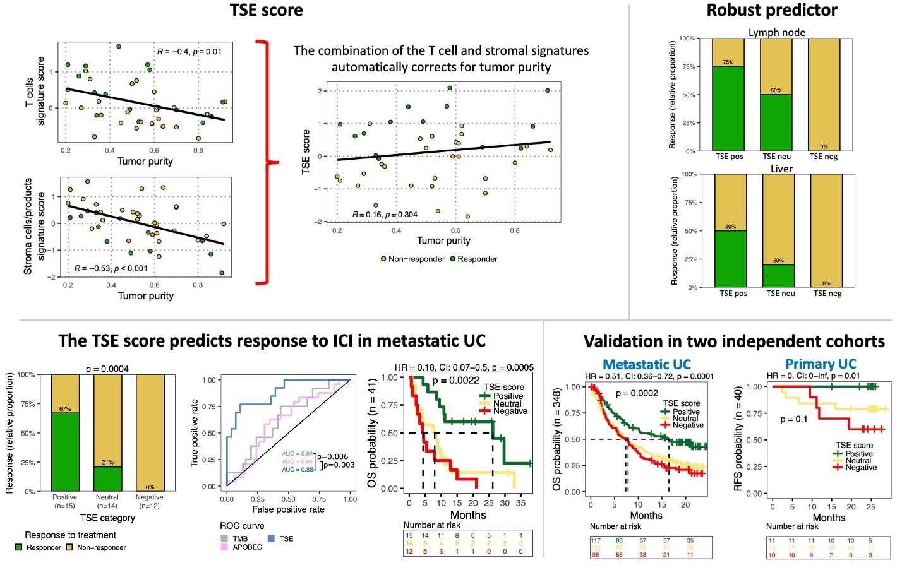

# T Cell-to-Stroma Enrichment (TSE) score: a gene expression metric that predicts response to immune checkpoint inhibitors (ICI) in patients with urothelial cancer

## Description

The **TSE score** is a transcriptomic metric that predicts response to ICIs. The study reported by Rijnders, Nakauma-Gonzalez, et al., entitled [Gene-expression-based T-Cell-to-Stroma Enrichment (TSE) score predicts response to immune checkpoint inhibitors in urothelial cancer](https://www.nature.com/articles/s41467-024-45714-0 "TSE score predicts response to ICI in Bladder Cancer") was published in Nature Communications.

We identified the abundance of T cells as a predictor of response, while the abundance of stromal cells/products is a predictor of non-response to ICI. Both predictors are affected by tumor purity, but when combined into the TSE score, the effect of purity disappears making the TSE score a robust biomarker even for immune cell-riched organs such as lymph nodes (Figure). Additionally, the TSE score can predict responders and non-responders because it combines the positive and negative predictive values of T and stromal cells into one single metric.



## Calculate the TSE score

To identify the TSE score category, you will have to clone this repository. A TSE classifier is available in the `classifier` folder. Load the classifier:

```         
source("classifier/TSE_classify.R")
load("data/centroids_TSE.RData")
```

Apply the classifier on a matrix of normalized RNA counts (matrixCounts; rows = gene symbols, columns = sampleId)

```         
TSEclass <- TSE_classify(x = matrixCounts, centroids_TSE = centroids_TSE)
```

The result is a table with the TSE category per sample. The classifier was built on a small set of n = 41 samples, thus it is highly recommended also to calculate the TSE value from RNA counts. The accuracy of the classifier was 73% in the TCGA data set, and 69% in the IMvigor210 cohort, although the OS curves (using the predicted or calculated TSE score) remain very similar in both cases.

To calculate the TSE score, you may follow the example provided in `5.TSEscoreCalculation_example.R`. A test data set is provided. For new data sets, they have to be a Matrix with samples as columns and gene names as rows (see test data set).

The other scripts were used to process the data provided by the Hartwig Medical Foundation (HMF) and to generate figures and results for the manuscript. Access to HMF data is controlled and must be requested under the request number DR-176. WGS data, RNA-seq data and corresponding clinical data are freely available for academic use from the HMF through standardized procedures. Request forms can be found at <https://www.hartwigmedicalfoundation.nl>.

## Reference

Rijnders, M., Nakauma-González, J.A., Robbrecht, D.G.J. *et al.* Gene-expression-based T-Cell-to-Stroma Enrichment (TSE) score predicts response to immune checkpoint inhibitors in urothelial cancer. *Nat Commun* **15**, 1349 (2024). <https://doi.org/10.1038/s41467-024-45714-0>
